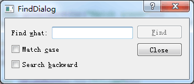

### 时间:2016年7月29日 天气:晴转雷阵雨:sunny:--->:zap:
-----
#####   Author:冬之晓:disappointed:
#####   Email: 347916416@qq.com
#####   MyAppearance: 
----------

<pre>
    今天早晨，第一次吃到这边的饭团，没想到还挺好吃的，就是米饭里面夹着咸菜和鸡
蛋、油条等食品。刚来的几天以为自己会不适应这边的环境，但是现感觉一切都不错。看
来我的适应能力还是比较强的。嘿嘿~
    今天我在公司已经有一个星期了，感觉自己必须赶快做点东西，否则实在是太难受了
！时不待我，每个人的自然生命虽然都有好几十年，到实际上都是转瞬即逝。如果不能把
握住每一天的时间，真的是对不起这一生！
</pre>

对于Qt的界面开发来说，信号和槽是最重要的，其连接机理规则包含：
- 一个信号可以连接多个槽
- 多个信号可以连接同一个槽
- 一个信号可以与另外一个信号相连
- 连接可以被移除

第四个属性比较少用，因为删除对象时，Qt会自动移除和这个对象相关的所有连接。
在有了信号和槽的概念后，就看以进行简单的交互功能程序的编写，如下面这个例子：

```C++
#include <QApplication>
#include <QPushButton>

int main(int argc, char *argv[])
{
    QApplication app(argc,argv);
    QPushButton *button = new QPushButton("eixt!");
    QObject::connect(button,SIGNAL(clicked()),&app,SLOT(quit()));
    button->show();
    return app.exec();
}
```
显示的结果是:   
程序逻辑中的`connect`就是实现了信号和槽的连接，这样单击图片中的exit按钮，就退出了程序。

有了基本的信号和槽的知识，就可以使用更加复杂的信号和槽，比如下面的例子：

```C++
#include <QApplication>
#include <QHBoxLayout>
#include <QSlider>
#include <QSpinBox>

int main(int argc, char *argv[])
{
    QApplication app(argc,argv);
    QWidget *window = new QWidget;
    window->setWindowTitle("请输入你的年龄：");
    window->setMinimumWidth(240);
    QSpinBox *spinBox = new QSpinBox;
    QSlider *slider = new QSlider(Qt::Horizontal);
    spinBox->setRange(0,130);
    slider->setRange(0,130);

    QObject::connect(slider,SIGNAL(valueChanged(int)),
                     spinBox,SLOT(setValue(int)));
    QObject::connect(spinBox,SIGNAL(valueChanged(int)),
                     slider,SLOT(setValue(int)));

    QHBoxLayout *hBoxLayout = new QHBoxLayout;
    hBoxLayout->addWidget(spinBox);
    hBoxLayout->addWidget(slider);
    window->setLayout(hBoxLayout);

    window->show();
    return app.exec();
}
```

显示的结果是:   
程序逻辑中的两个`connect`信号和槽的连接，保证了里面的两个控件`QSpinBox`和`QSlider`之间的通信，使其相互影响，对应的输入数字保持一致。

##### 对话框编程

对应界面编程来说，对话框绝对是必不可少的，用Qt在进行创建对话框的编程时需遵循以下几个步骤：

1. 创建并初始化子窗口部件
2. 把子窗口部件放到布局中
3. 设置Tab键顺序
4. 建立信号-槽之间的连接
5. 实现对话框中的自定义槽

Qt其自身的定位就是快速的开发界面程序。因此其自身实现了非常强大的界面编辑功能。这些功能体现在对话框中更是妙不可言，比如下面这个例子：

- 头文件`finddialog.h`

```C++
#ifndef FINDDIALOG_H
#define FINDDIALOG_H

#include <QDialog>

class QCheckBox;
class QLabel;
class QLineEdit;
class QPushButton;

class FindDialog:public QDialog
{
    Q_OBJECT

public:
    explicit FindDialog(QWidget *parent=0);

signals:
    void findNext(const QString &str,Qt::CaseSensitivity cs);
    void findPrevious(const QString &str,Qt::CaseSensitivity cs);

private slots:
    void findClicked();
    void enableFindButton(const QString &text);

private:
    QLabel *_label;
    QLineEdit *_lineEdit;
    QCheckBox *_caseCheckBox;
    QCheckBox *_backwardCheckBox;
    QPushButton *_findButton;
    QPushButton *_closeButton;
};

#endif // FINDDIALOG_H
```

- 源文件`finddialog.cpp`

```C++
#include <QLabel>
#include <QLineEdit>
#include <QCheckBox>
#include <QPushButton>
#include <QLayout>

#include "finddialog.h"

FindDialog::FindDialog(QWidget *parent)
{
    _label = new QLabel(tr("Find &what:"));
    _lineEdit = new QLineEdit;
    _label->setBuddy(_lineEdit);

    _caseCheckBox = new QCheckBox(tr("Match &case"));
    _backwardCheckBox = new QCheckBox(tr("Search &backward"));

    _findButton = new QPushButton(tr("&Find"));
    _findButton->setDefault(true);
    _findButton->setEnabled(false);

    _closeButton = new QPushButton(tr("Close"));
    /*连接必要的信号和槽*/
    connect(_lineEdit,SIGNAL(textChanged(QString)),
              this,SLOT(enableFindButton(QString)));
    connect(_findButton,SIGNAL(clicked()),
            this,SLOT(findClicked()));
    connect(_closeButton,SIGNAL(clicked()),
            this,SLOT(close()));

    QHBoxLayout *topLeftLayout = new QHBoxLayout;
    topLeftLayout->addWidget(_label);
    topLeftLayout->addWidget(_lineEdit);

    QVBoxLayout *leftLayout = new QVBoxLayout;
    leftLayout->addLayout(topLeftLayout);
    leftLayout->addWidget(_caseCheckBox);
    leftLayout->addWidget(_backwardCheckBox);

    QVBoxLayout *rightLayout = new QVBoxLayout;
    rightLayout->addWidget(_findButton);
    rightLayout->addWidget(_closeButton);
    rightLayout->addStretch();

    QHBoxLayout *mainLayout = new QHBoxLayout;
    mainLayout->addLayout(leftLayout);
    mainLayout->addLayout(rightLayout);
    setLayout(mainLayout);
}

void FindDialog::findClicked()
{
    QString text = _lineEdit->text();
    Qt::CaseSensitivity cs =
            _caseCheckBox->isChecked() ? Qt::CaseSensitive
                                      : Qt::CaseInsensitive;
    if(_backwardCheckBox->isChecked())
    {
        emit findPrevious(text,cs);
    }
    else
    {
        emit findNext(text,cs);
    }
}

void FindDialog::enableFindButton(const QString &text)
{
    _findButton->setEnabled(!text.isEmpty());
}

```

- main函数部分

```C++
#include <QApplication>
#include "finddialog.h"

int main(int argc, char *argv[])
{
    QApplication app(argc,argv);
    FindDialog *findDialog = new FindDialog;
    findDialog->setWindowTitle("FindDialog");
    findDialog->show();
    return app.exec();
}
```

这个程序得到的结果是： 

可以看出，这个就是一个常用的查找对话框，里面使用了Qt常用的布局管理模块，非常简单就可以把界面的控件罗列到一起，同时里面的信号和槽实现了逻辑的连接！当然这只是控件的复杂实现方法，QtCreator的强大之处是可以把常用控件使用拖放的方式连接到一起，大大简化了界面编程的逻辑和代码量，其中的精彩我们下回再说！
