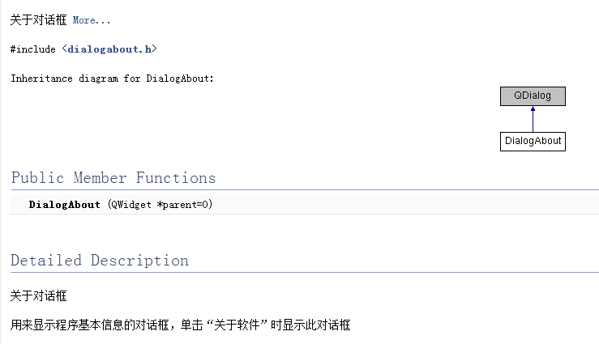

### 时间:2016年8月7日 天气:晴:sunny:
-----
#####   Author:冬之晓:dizzy_face:
#####   Email: 347916416@qq.com
#####   MyAppearance: 
----------

<pre>
    今天天气放晴，温度又回升了，因此我决定在寝室休息一天，不做运动，贮备能量……
</pre>

最近，我通过看别人的没有文档代码，终于醒悟了，感觉到了文档的重要性！(看不懂别人代码的痛苦太难受了！) 所以我觉定，趁着周末赶快学习一下如何使用文档生成工具。  
通过网上检索，我发现`Doxygen`是一个很常用的文档生成工具。进入[Doxygen官网](http://www.stack.nl/~dimitri/doxygen/ "Doxygen官网:http://www.stack.nl/~dimitri/doxygen/")，然后从`Downloads`标签里面获取Windows版的安装包(当然其他主流操作系统也都支持，要自己选择对应版本)。  
下载并安装好后，发现里面有详细的说明文档，其自己的文档就是自己的软件生成的！看了这文档我感觉非常友好。只要在编程的时候按照固定的格式添加注释，以后就可以用这个软件直接生成一个文档，是一个非常好用的文档生成工具！以后我决定就按照其注释规范来进行代码注释了！

#### 简单介绍一下Doxygen注释格式

- 因为我一般用C/C\+\+编程，因此这里主要介绍对应的标注方式：

1. 可以使用两个`*`号进行标注：

```C++
/**
 * ... text ...
 */
```

2. 可以使用`*!`的方式进行标注：

```C++
/*!
 * ... text ...
 */
```

在这种情况下中间的`*`可以省略！如下：  

```C++
/*!
 ... text ...
*/
```

3. 可以使用`/`和`！`，如下所示的两种方法：

```C++
///
/// ... text ...
///

//!
//!... text ...
//!
```

我一般喜欢使用`//!`，因此后面的描述都以此为基础。
同时`Doxygen`比较强大的一点是它还支持`Markdown`语法和`HTML`语法，这样就实在太方便了！！今天尝试了一下`Markdown`语法中的表格(`|`)、标题(`#`)、超连接(`[]()`)都可以成功。具体可以支持的语法，以后再细说。

- 在进行注释的时候，可以有一些特殊的命令

特殊命令一般以`\`或者`@`开头，这样后面跟对应的变量然后就可以进行特殊的标识，比如较为常用的`@brief`和`@details`代表一个注释的简单描述和详细描述。举个例子：

```C++
//! @class DialogAbout
//! @brief 关于对话框
//! @details 用来显示程序基本信息的对话框，单击“关于软件”时显示此对话框
class DialogAbout : public QDialog
{
    Q_OBJECT

public:
    explicit DialogAbout(QWidget *parent = 0);
    ~DialogAbout();

private:
    Ui::DialogAbout *ui;
};
```

这样生成的文档就会是：  


可以看出，生成的文档非常美观，还有继承关系图！当然，`Doxygen`的用法还有很多内容，让我们下次再细说！